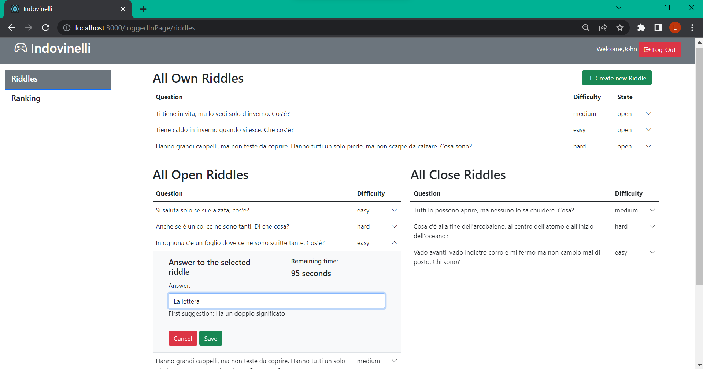

# Exam #2: "Indovinelli"
## Student: s303462 SCIARA LORENZO 

## React Client Application Routes

- Route `/`: Home page with a side bar, the log-In button and the list of all riddles and their informations (visible to anonymous visitors);
- Route `/homePage/:filter`: Home page with a side bar, the log-In button and, according to the filter, the list of riddles or the ranking can be present (visible to anonymous visitors);
- Route `/login`: Form for the login;
- Route `/loggedInPage/:filter`: Logged-In home page with a side bar, the log-Out button, the button to create a new riddle and, according to the filter, the list of own, open (with relative form ti add answer) and close riddles, or the ranking can be present (visible to anonymous visitors);
- Route `/addRiddle`: Form to add a new riddle;
- Route `/*`: Page for wrong URL; It contains a link to the home page;

## API Server

- GET `/api/riddlesAnon`
  - Descrition: it returns the list of all riddles with the informations for the anonymous users;
  - No request parameters and body;
  - It responds with a list of riddles or `500` in case of error; Response body example:
  ```
    [
      { 
      riddleid: 11,
      question: 'Si saluta solo se si è alzata, cos’è?',
      difficulty: 'easy',
      state: 1
      },   
      { 
      riddleid: 10,
      question: 'Tutti lo possono aprire, ma nessuno lo sa chiudere. Cosa?',
      difficulty: 'medium', 
      state: 0
      },
      ...
    ]
  ```

- GET `/api/riddles`
  - Descrition: it returns the list of all riddles;
  - No request parameters and body;
  - It responds with a list of riddles or `500` in case of error; Response body example:
  ```
    [
      { 
      riddleid: 11,
      question: 'Si saluta solo se si è alzata, cos’è?',
      difficulty: 'easy', 
      duration: 60000	,
      correctAnswer: 'La bandiera',
      openingDate: null,
      suggestion1: 'Quella italiana è a strisce', 
      suggestion2: 'Quella italiana è verde, bianca e rossa',
      state: 1,
      userid: 3,
      winner: null,
      },   
      { 
      riddleid: 10,
      question: 'Tutti lo possono aprire, ma nessuno lo sa chiudere. Cosa?',
      difficulty: 'medium', 
      duration: 60000	,
      correctAnswer: 'L'uovo',
      openingDate: dayjs(2022-07-08 18:26:41),
      suggestion1: 'Lo fa la gallina', 
      suggestion2: '	Ovale',
      state: 0,
      userid: 3,
      winner: 'Maria',
      },
      ...
    ]
  ```

- GET `/api/answers`
  - Descrition: it returns the list of all answers;
  - No request parameters and body;
  - It responds with a list of answers or `500` in case of error; Response body example:
  ```
    [
      { 
      answer: 'La porta',
      riddleid: 10,
      userid: 1,
      },   
      { 
      answer: 'Il regalo',
      riddleid: 10,
      userid: 2,
      },
      ...
    ]
  ```

- POST `/api/riddles`
  - Descrition: it add an element in the riddle list;
  - It requires the riddle to be entered; Request body example:
  ```
    {
      question: 'Anche se è unico, ce ne sono tanti. Di che cosa?', 
      difficulty: 'hard',
      duration: 240000,
      correctAnswer: 'I sensi unici in città',
      suggestion1: 'Possono essere indicati da cartelli stradali',
      suggestion2: 'Ci si può muovere solo in una direzione',
    }
  ```
  - No response body; It responds with `201` or `503` in case of service unavailable, `422` in case of unprocessable entity;

- PUT `/api/riddles/:riddleid/checkState`
  - Descrition: it update the state of an element in the riddles list, checking first if the state is to be updated;
  - It requires the riddleid of riddle to modify; Request body example:
  ```
    {
      riddleid: 14
    }
  ```
  - No response body; It responds with `200` or `503` in case of service unavailable;

- POST `/api/answers`
  - Descrition: it add an element in the answers list and check if the answer is right (then it updates the related fields of the riddle) or not;
  - It requires the answer to be entered; Request body example:
  ```
    {
      answer: 'La pentola d'oro', 
      riddleid: '12',
    }
  ```
  - No response body; It responds with `201` or `503` in case of service unavailable, `422` in case of unprocessable entity, `404` in case of wrong riddleid;

- GET `/api/users/ranking`
  - Descrition: it returns the first users with the three highest scores in the ranking;
  - No request parameters and body;
  - It responds with a list of answers or `500` in case of error; Response body example:
  ```
    [
      { 
      name: 'Mario',
      point: 3,
      position: 1,
      },   
      { 
      name: 'Maria',
      point: 2,
      position: 2,
      },
      ...
    ]
  ```

- POST `/api/sessions`
  - Descrition: send username and password for the logIn;
  - It requires an object representing a user (Content-Type: `application/json`):
  ```
    {
      user: 'testuser@polito.it', 
      password: 'password',
    }
  ```
  - No response body; It responds with `200 OK` (success) or `500 Internal Server Error` (generic error);

- DELETE `/api/sessions/current`
  - Descrition: Log-Out;
  - No request parameters and body;
  - No response body; It responds with `200 OK` (success) or `500 Internal Server Error` (generic error);

- GET `/api/sessions/current`
  - Descrition: Get all the user;
  - No request parameters and body;
  - It responds with `200 OK` (success) or `401` in case of unauthenticated user or `500` in case of generic error; Response body example:
  ```
    {
      id: 3,
      username: 'testuser@polito.it', 
      name: 'test', 
    }
  ```

## Database Tables

- Table `user` - contains userid email name hash salt points;
It contains the information of the users;
- Table `riddle` - contains riddleid question difficulty duration correctAnswer openingDate suggestion1 suggestion2 state userid winner;
It contains the information of the riddle: duration: is the maximum value of the timer; openingDate: is the date (and hours) of the first answer (wen the timer starts); state: can be open or close
- Table `answer` - contains userid riddleid answer
It contains the information of the answrs;

## Main React Components

- `HomePage` (in `homePage.js`): It is the page where the list of all riddles and ranking is shown before login;
- `SideBar` (in `sideBar.js`): It select the ranking or riddle tables, both on the home page and on the page after login;
- `Loading` (in `loading.js`): It prints a loading wheel; 
- `NoMatch` (in `noMatch.js`): It shows the page in case of wrong URL;
- `LoggedInPage` (in `loggedInPage.js`): It is the page where the lists of riddles and ranking is shown after login;
- `Ranking` (in `ranking.js`): It shows a ranking table of the first three users by score;
- `HomePageRiddleListTable` (in `riddleTable.js`): It shows the table of all riddles for anonymous users (in the home page before log-In);
- `CloseRiddleListTable` (in `riddleTable.js`): It shows the table of close riddles for logged-in users (in the home page after log-In);
- `OpenRiddleListTable` (in `riddleTable.js`): It shows the table of open riddles for logged-in users (in the home page after log-In); 
- `OwnRiddleListTable` (in `riddleTable.js`): It shows the table of own riddles for logged-in users (in the home page after log-In);
- `RiddleForm` (in `RiddleForm.js`): It shows the form for the creation of a new riddle (with related fields for creation);
- `AnswerToRiddleForm` (in `answerToRiddleForm.js`): It shows the form for the creation of a new answer to a specific riddle (with related field for the answer);
- `Timer` (in `timer.js`): It prints the passed value in seconds;

## Screenshot



## Users Credentials

- username: john.doe@polito.it, password: password (name: John)
- username: mario.rossi@polito.it, password: password (name: Mario)
- username: testuser@polito.it, password: password (name: Test)
- username: luca.verdi@polito.it, password: password (name: Luca)
- username: maria.rosa@polito.it, password: password (name: Maria)
